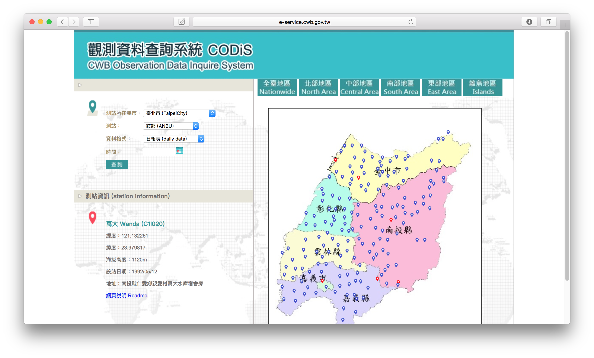

# 觀測資料匯出月份程式(CODiS)

基於本實驗室研究巨量資料需求所開發之資料匯出程式。

## 環境需求

* npm

## 執行

進入[觀測資料查詢系統](http://e-service.cwb.gov.tw/HistoryDataQuery/index.jsp)選擇你想要匯出的**測站**與**時間** : 

> 由測站資訊取得**測站代號**

安裝相依套件 :

```
$ npm install request 
$ npm install cheerio 
$ npm install fs 
$ npm install json2csv
```

執行擷取程式 :

```
$ node index.js C1I020 2017-07
```
> node index.js <測站代號> <年-月>

系統在目錄下產生 file.csv


